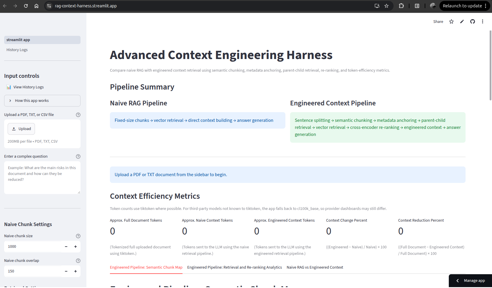

# Advanced Context Engineering Harness

A research-oriented Streamlit lab for comparing **naive RAG** against an **engineered context pipeline** on the same document and query. The goal is to make retrieval design choices visible: chunking, metadata, parent–child structure, re-ranking, token budget, and answer quality.

**Live demo:** [rag-context-harness.streamlit.app](https://rag-context-harness.streamlit.app/)



*Overview of the side-by-side pipeline comparison UI. Replace `docs/images/app_overview.png` with a capture from your deployment if you prefer a pixel-accurate screenshot.*

---

## Why this project exists

Naive RAG is a useful baseline, but production systems rarely stop at fixed-size chunks and top-*k* vector search. This harness runs both approaches side by side so you can observe how context engineering changes what the model actually sees—and how many tokens that costs.

It is intentionally built as a **progressive research sandbox**: the current release focuses on interpretable pipelines and metrics; later phases will add stronger retrieval backends, evaluation harnesses, and automated benchmarks.

---

## What you can do today

| Capability | Naive pipeline | Engineered pipeline |
|------------|----------------|---------------------|
| Chunking | Fixed-size windows | Semantic sentence grouping |
| Structure | Flat chunks | Metadata anchors + parent–child units |
| Retrieval | Embedding similarity | Vector search + cross-encoder re-rank |
| Observability | Token metrics | Same metrics + chunk similarity views |
| Output | LLM answer from retrieved context | LLM answer from refined context |

Additional features:

- **Tabbed analysis** — chunking, retrieval, and side-by-side answers with expandable context blocks
- **Token accounting** — document, context, and answer sizes via `tiktoken`
- **Process logging** — run history with timings on the **History Logs** page (`pages/1_History_Logs.py`)
- **Secrets-only LLM config** — API key and base URL from Streamlit secrets (never stored in the UI or logs)

---

## Architecture (high level)

```text
Upload (PDF/TXT) → Clean text
       ├─ Naive: fixed chunks → embed → retrieve → answer
       └─ Engineered: semantic chunks → anchor metadata → parent/child index
                        → vector search → re-rank → build context → answer
```

Source layout:

```text
advanced-context-engineering-harness/
├── streamlit_app.py          # Main UI and orchestration
├── pages/1_History_Logs.py   # Run history and CSV export
├── docs/images/              # README assets
├── src/
│   ├── config/               # Model and pipeline defaults
│   ├── ingestion/            # Load and clean documents
│   ├── chunking/             # Naive and semantic chunkers
│   ├── metadata/             # Metadata anchoring
│   ├── retrieval/            # Embeddings, vector store, parent–child, re-ranker
│   ├── generation/           # Context builder and LLM client
│   ├── metrics/              # Token and efficiency metrics
│   ├── evaluation/           # Process logs and similarity analysis
│   └── ui/                   # Shared Streamlit components
└── requirements.txt
```

---

## Run locally

**1. Clone and install**

```bash
git clone https://github.com/<your-org>/advanced-context-engineering-harness.git
cd advanced-context-engineering-harness
python -m venv .venv
source .venv/bin/activate   # Windows: .venv\Scripts\activate
pip install -r requirements.txt
```

**2. Configure secrets**

Copy the example and add your provider credentials:

```bash
mkdir -p .streamlit
cp .streamlit/secrets-example.toml .streamlit/secrets.toml
```

Edit `.streamlit/secrets.toml`:

```toml
LLM_API_KEY = "your_api_key_here"
LLM_BASE_URL = "your_provider_base_url_here"
```

**3. Start the app**

```bash
streamlit run streamlit_app.py
```

Open the URL shown in the terminal (typically `http://localhost:8501`). Upload a PDF or text file, enter a question, and run both pipelines.

> **Note:** First run may download sentence-transformer and cross-encoder models; allow a few minutes on a cold start.

---

## Roadmap and research directions

Planned extensions (not all implemented yet):

- **Retrieval** — hybrid sparse–dense search, query rewriting, and optional FAISS / managed vector backends
- **Evaluation** — golden Q&A sets, RAGAS-style scores, and regression dashboards tied to `logs/process_logs.csv`
- **Context policies** — adaptive chunk sizes, compression, and citation-grounded answers
- **Multimodal** — layout-aware PDF parsing and image/table-aware chunking
- **Automation** — batch runs, experiment configs, and reproducible benchmark reports

Contributions and experiment notes are welcome; this repo is meant to grow with each research iteration rather than ship as a one-off demo.

---
## License

This project represents my original research work. It is open-source and free to use, modify, and distribute for personal, academic, or commercial purposes.
